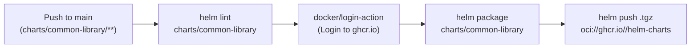

# DevOps — Common Helm Library Charts (`devops`)

This repository provides reusable, enterprise-grade Helm Library Charts (`type: library`) designed to eliminate boilerplate, enforce organizational security standards, and simplify Kubernetes resource declarations across all microservices.

---

## Architectural Concept

In traditional Helm setups, each microservice copies hundreds of lines of YAML boilerplate (`deployment.yaml`, `service.yaml`, `hpa.yaml`, etc.). 

With the **Helm Library Chart pattern**, the entire Kubernetes specification is encapsulated in reusable Go template definitions within `charts/common-library`. Downstream application charts (such as `photoblog-helm-charts`) simply declare a dependency on `common-library` and invoke templates with a single line:

```yaml
{{- include "common.deployment" . -}}
```

---

## Available Templates in `common-library`

| Template Name | Source File | Description |
| :--- | :--- | :--- |
| `common.deployment` | `templates/_deployment.tpl` | Generates a complete Kubernetes `Deployment` with pod security context, container security context, configurable health probes (`livenessProbe`, `readinessProbe`), environment variable injections, volume mounts, and affinity rules. |
| `common.service` | `templates/_service.tpl` | Creates a Kubernetes `Service` (ClusterIP, NodePort, or LoadBalancer) pointing to the pod container port. |
| `common.ingress` | `templates/_ingress.tpl` | Deploys a standard Kubernetes `Ingress` with support for `ingressClassName`, custom annotations (e.g. cert-manager), multi-host routing, and TLS termination. |
| `common.httproute` | `templates/_httproute.tpl` | Deploys a Gateway API `HTTPRoute` resource with parentRefs and rule matching. |
| `common.hpa` | `templates/_hpa.tpl` | Provisions a `HorizontalPodAutoscaler` (autoscaling/v2) with configurable CPU and memory target utilization percentages. |
| `common.serviceaccount` | `templates/_serviceaccount.tpl` | Generates a dedicated `ServiceAccount` with configurable annotations and `automountServiceAccountToken` toggles. |
| `common.names.*` | `templates/_helpers.tpl` | Standard Helm helper functions computing chart name, full name, standard labels (`app.kubernetes.io/name`, `instance`, `version`, `managed-by`), and selector labels. |

---

## Standardized Security Posture

The library chart enforces strict security defaults on all workloads:

- **Non-Root Execution**: `runAsNonRoot: true` and `runAsUser: 1001`.
- **Privilege Escalation Blocked**: `allowPrivilegeEscalation: false`.
- **Capability Dropping**: Drops all default Linux capabilities (`capabilities: { drop: ["ALL"] }`).
- **Health Verification**: Enforces both `livenessProbe` and `readinessProbe` to guarantee zero-downtime rolling updates.

---

## How to Consume in Application Charts

### 1. Declare Dependency in `Chart.yaml`
```yaml
apiVersion: v2
name: my-microservice
type: application
version: 0.1.0
dependencies:
  - name: common-library
    version: "1.0.0"
    repository: "oci://ghcr.io/agusikprogramusik/helm-charts"
```

### 2. Update Helm Dependencies
```bash
helm dependency update
```

### 3. Replace Manifest Files with One-Liners
In your application chart's `templates/` folder:
- `templates/deployment.yaml`:
  ```yaml
  {{- include "common.deployment" . -}}
  ```
- `templates/service.yaml`:
  ```yaml
  {{- include "common.service" . -}}
  ```
- `templates/serviceaccount.yaml`:
  ```yaml
  {{- include "common.serviceaccount" . -}}
  ```
- `templates/ingress.yaml`:
  ```yaml
  {{- include "common.ingress" . -}}
  ```
- `templates/hpa.yaml`:
  ```yaml
  {{- include "common.hpa" . -}}
  ```

---

## CI/CD & Automated Publishing

Chart changes are validated and published automatically using GitHub Actions (`.github/workflows/release.yaml`):



Whenever changes to `charts/common-library/**` are merged to `main`:
1. The chart is linted with `helm lint`.
2. The runner logs in to GitHub Container Registry (`ghcr.io`).
3. The chart package is created and pushed as an OCI artifact to `oci://ghcr.io/agusikprogramusik/helm-charts`.

