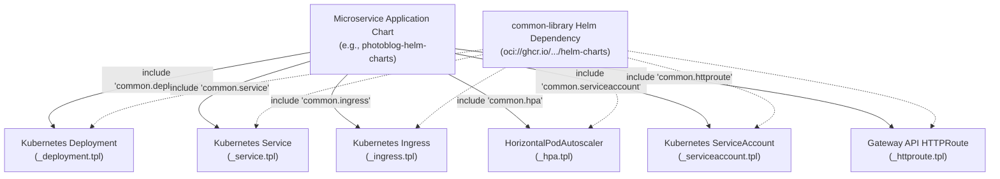

# Common Library Helm Chart Architecture

## 1. Executive Summary & Design Pattern
The `common-library` chart (`devops/charts/common-library`) implements the **Helm Library Chart Pattern** (`type: library`). It eliminates repetitive boilerplate across the organization's microservices by encapsulating best-practice Kubernetes resources into reusable Go template definitions.

## 2. Encapsulated Template Manifests

## 3. Template Reference Table

| Template Identifier | Source File | Standard Capabilities Provided |
| :--- | :--- | :--- |
| `common.deployment` | `_deployment.tpl` | RollingUpdate strategy, pod anti-affinity, non-root security contexts, liveness/readiness probes, env vars, configMap/secret mounts. |
| `common.service` | `_service.tpl` | ClusterIP, NodePort, LoadBalancer routing to target container port. |
| `common.ingress` | `_ingress.tpl` | IngressClass routing, TLS certificate integration with `cert-manager`. |
| `common.hpa` | `_hpa.tpl` | `autoscaling/v2` CPU and memory autoscaling thresholds. |
| `common.httproute` | `_httproute.tpl` | Kubernetes Gateway API modern routing. |
| `common.serviceaccount`| `_serviceaccount.tpl`| Least-privilege IAM service account creation. |

## 4. Default Security Baseline
Every resource generated by `common-library` enforces corporate security defaults:
* Non-root user execution (`runAsNonRoot: true`, UID: `1001`).
* Privilege escalation prevention (`allowPrivilegeEscalation: false`).
* Linux kernel capability dropping (`capabilities: { drop: ["ALL"] }`).
* Read-only root filesystem when configured.
